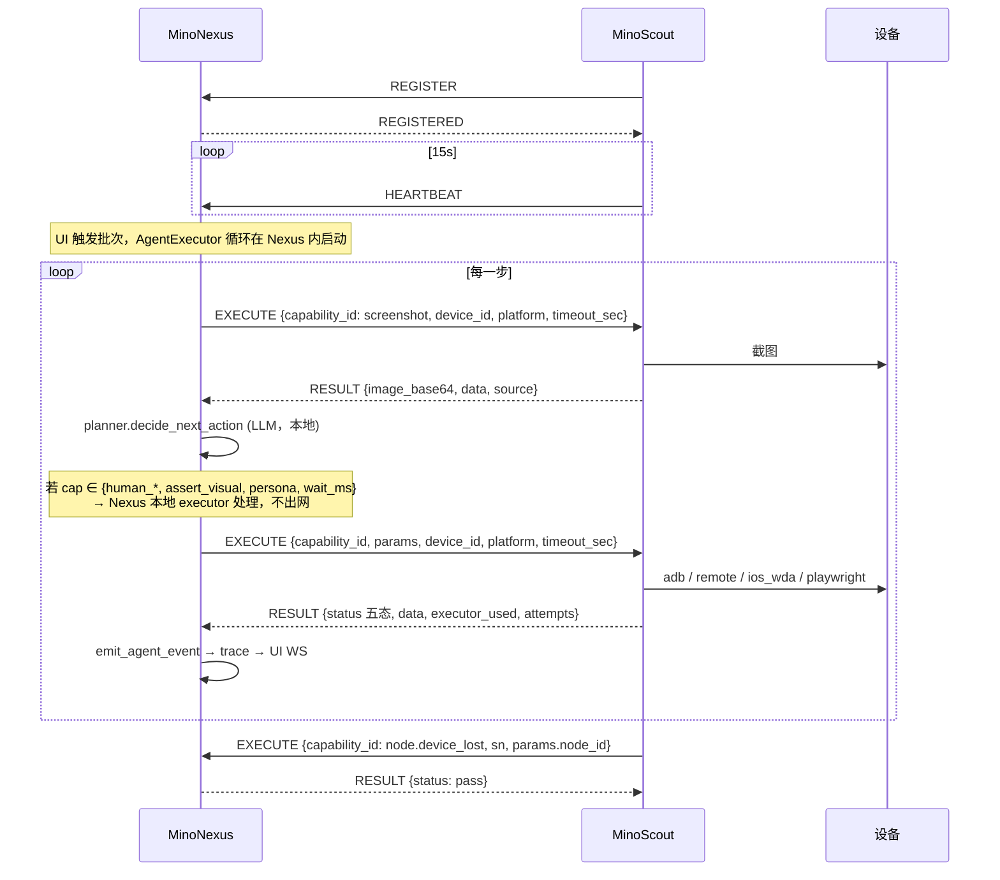

# PROTOCOL — MinoNexus ⇄ MinoScout

> **本文在 MinoNexus 与 MinoScout 两个仓库各有一份，必须逐字相同。**
> 契约真源是 `tests/fixtures/protocol/*.json`（两仓字节相同）。改协议的流程见各仓 `CLAUDE.md` §5。
> 协议版本：`2`

用例步骤与框架指令的统一出入口是 `EXECUTE` → `RESULT`。截图、层级、探活、取消 run、节点 stop/restart/update、设备热插拔都是 `capability_id`，走同一套形状。线上只有五种 `type`：`REGISTER` / `REGISTERED` / `HEARTBEAT` / `EXECUTE` / `RESULT`。没有 `OBSERVE` / `PROBE` / `CANCEL_RUN` / `NODE_EVENT` / `NODE_COMMAND`。

加字段时 dumps **省略空值**（`device_id` / `platform` 空字符串、`data` 空 dict）。

---

## 1. 传输与连接

| 项 | 规定 |
|---|---|
| 传输 | WebSocket，文本帧，UTF-8 JSON，一帧一条消息 |
| 方向 | **Scout 主动 dial Nexus**。Scout 永不监听对外端口 |
| 端点 | `ws(s)://<nexus-host>:<port>/node` |
| 单机默认 | `ws://mino.local:10104/node` |
| 鉴权 | 首帧 `REGISTER` 携带 `token`（配对时由 Nexus 下发）。Nexus 校验失败即关闭连接，close code `1008` |
| 重连 | Scout 侧指数退避（1s → 2s → 4s → … 上限 30s），无限重试 |
| 心跳 | Scout 每 15s 发 `HEARTBEAT`；Nexus 45s 未收到视为节点掉线 |
| 大载荷 | 截图以 base64 放在 JSON 里。单帧上限 32 MiB；超限时 Scout 必须降质重发而不是分片 |

## 2. 消息信封

所有消息共用同一信封：

```json
{
  "v": 2,
  "type": "EXECUTE",
  "msg_id": "01J8ZQ...",
  "reply_to": null,
  "ts": "2026-09-02T15:30:01.123456+08:00",
  "payload": { }
}
```

| 字段 | 类型 | 说明 |
|---|---|---|
| `v` | int | 协议版本。收到不认识的版本：Nexus 关连接并在 UI 报错；Scout 关连接并退避重连 |
| `type` | str | 见 §3 |
| `msg_id` | str | ULID。发送方生成，全局唯一 |
| `reply_to` | str \| null | 应答类消息填对应请求的 `msg_id` |
| `ts` | str | ISO-8601 带时区 |
| `payload` | object | 各消息自己的载荷 |

**应答规则**：`ACK 必须` 的消息，接收方必须回一条 `reply_to` 指向它的消息；发送方超时未收到则按 §6 重试。

---

## 3. 消息总表

| # | 方向 | `type` | ACK | 说明 |
|---|---|---|---|---|
| 1 | S→N | `REGISTER` | 必须 | 上报身份、能力、挂载设备。应答 `REGISTERED` |
| 2 | N→S | `REGISTERED` | — | `REGISTER` 的应答 |
| 3 | S→N | `HEARTBEAT` | 否 | 保活 + 连通性/设备变化增量 |
| 4 | 双向 | `EXECUTE` | 必须 | 能力或框架指令。N→S：截图 / 点击 / `probe` / `cancel_run` / `node.stop` 等。S→N：`node.device_lost` 等热插拔 |
| 5 | 双向 | `RESULT` | — | `EXECUTE` 的应答，靠 `reply_to` 配对 |

> **协议里没有 `DECIDE` / `STEP_EVENT` / `RUN_FINISH` / `NEED_HUMAN`。**
> 执行循环在 Nexus（见 [ARCHITECTURE.md](ARCHITECTURE.md)），决策、trace 落库、问人全部在 Nexus 本地完成，不过网。
> 用例主通信只剩 `EXECUTE` ↔ `RESULT`。

---

## 4. 各消息载荷

### 4.1 `REGISTER`（S→N，ACK 必须）

```json
{
  "node_id": "3f8a1c0e9b2d4f71",
  "token": "<pair-token>",
  "platform": "darwin",
  "arch": "arm64",
  "scout_version": "0.1.0",
  "protocol_version": 2,
  "hostname": "mac-studio.local",
  "studio_id": "a1b2c3d4e5f67890",
  "executors": [
    {"id": "adb", "available": true,
     "provides": ["system_shell","system_pkg_install","system_pkg_clear","read_system_data",
                  "ui_native_input","ui_input_text","ui_screenshot",
                  "app_launch_native","app_force_stop","clipboard_set","key_event"]},
    {"id": "remote", "available": true,
     "provides": ["ui_native_input","ui_input_text","ui_screenshot","ui_stream",
                  "app_launch_native","clipboard_set","key_event","system_pkg_install",
                  "read_system_data","exec_script"]},
    {"id": "ios_wda", "available": false, "provides": [], "reason": "no WDA runtime"},
    {"id": "playwright", "available": true, "provides": ["ui_native_input","ui_screenshot"]}
  ],
  "devices": [
    {"sn": "R5CT30xxxx", "platform": "android", "model": "SM-S9210",
     "channels": {"adb": "connected", "remote": "connected"}},
    {"sn": "claw-abc123", "platform": "android",
     "channels": {"adb": "disconnected", "remote": "connected"}},
    {"sn": "web3f8a1c0e9b2d4f71", "platform": "web", "channels": {"playwright": "connected"}}
  ]
}
```

| 字段 | 规定 |
|---|---|
| `node_id` | 节点稳定标识，**不等于任何 `sn`**。取值 `[a-z0-9]{16}`（Scout 持久化的 `scout_id`），重启后不变。Playwright 槽 `sn` 为 `web` + `node_id` |
| `hostname` | 本机主机名，可空。只作展示 |
| `studio_id` | 写入本机 Scout 配置的工作台 id（`[a-z0-9]{16}`），可空。Nexus 据此记归属 |
| `executors[].id` | 必须是 `adb` / `remote` / `ios_wda` / `playwright` 之一 |
| `executors[].provides` | **abstract cap id 列表**。取值域由 `catalog_entries`（`kind=abstract_cap`）定义（Nexus 侧真源），Scout 只报字符串 |
| `executors[].available` | `false` 时 `provides` 必须为空数组，并给 `reason` |
| `devices[].channels` | 取值：`connected` / `disconnected` / `unauthorized` / `not_applicable` |

Nexus 收到后：`provides` ∩ 能力目录 → 该节点可执行的 capability 集合；`devices[]` 写入设备表并标记 `node_id` 归属。

### 4.2 `REGISTERED`（N→S）

```json
{
  "accepted": true,
  "session_token": "<short-lived>",
  "heartbeat_interval_sec": 15,
  "nexus_version": "0.1.0",
  "protocol_version": 2,
  "warnings": ["device claw-abc123 未在 Nexus 侧登记，已自动创建"]
}
```

`accepted: false` 时必须给 `reason`，Scout 记录后按退避重连（不要立刻重试，避免打爆）。

### 4.3 `HEARTBEAT`（S→N，不需 ACK）

```json
{
  "node_id": "3f8a1c0e9b2d4f71",
  "uptime_sec": 3721,
  "busy": true,
  "active_runs": ["run_20260902_153001_R5CT30"],
  "device_delta": [
    {"sn": "R5CT30xxxx", "channels": {"adb": "disconnected", "remote": "connected"}}
  ]
}
```

`device_delta` 只报**变化**的设备；无变化时可省略。Nexus 据此更新连通性，并在下一次组装菜单时生效。权威设备状态以心跳为准；`EXECUTE node.device_*` 是即时通知。

### 4.4 `EXECUTE`（双向，ACK 必须，幂等）

能力和框架指令的统一出入口。超过 `timeout_sec` 接收方必须停止等待并回 `RESULT status=fail`（见 §6）。

```json
{
  "run_id": "run_20260902_153001_R5CT30",
  "step_idx": 7,
  "sn": "R5CT30xxxx",
  "device_id": "R5CT30xxxx",
  "platform": "android",
  "capability_id": "tap_element",
  "params": {"x": 512, "y": 830},
  "executor_order": ["remote", "adb"],
  "low_level": {"command": "TAP", "params": {"x": "{x}", "y": "{y}"}},
  "selected_impl": {"id": "vlm_locate_remote_tap", "needs_vlm": true},
  "device_hint": {"adb_serial": "R5CT30xxxx", "password": "***", "ttl_sec": 3600},
  "timeout_sec": 30
}
```

| 字段 | 规定 |
|---|---|
| `capability_id` | 能力或框架指令 id。Scout 不校验它是否存在于目录（目录在 Nexus），只看自己的 executor `supports()` 或内置框架 cap |
| `params` | **坐标一律是 0–1000 归一化千分比，不是像素。** Scout 负责按实际分辨率换算。观察类能力可带 `compress_ratio` 等 |
| `device_id` | 可选。设备唯一 ID；空则回退 `sn` / `device_hint`。**dumps 时空字符串省略** |
| `platform` | 可选。`android` \| `ios` \| `web` \| `playwright` \| `other`。空则从 `sn` / `device_hint` 猜测。**dumps 时空字符串省略** |
| `sn` | 设备串号；web/playwright 可为槽位 sn 或字面 `playwright` |
| `executor_order` | **由 Nexus 按这台 `sn` 算好**，只含该设备适用的通道（Web 不得含 `adb`，安卓/iOS 不得含 `playwright`）。同设备内的 fallback（如同一部安卓的 `adb`→`remote`）可以是列表；**禁止把不同类型设备的通道排进同一条链。** 非空时 Scout 只在该 `sn` 上按序尝试，类型不符的 executor **declined，不碰设备**。空则按 **该 sn 的 platform** 填：android→`adb,remote`，ios→`ios_wda`，web/playwright→`playwright`。**禁止** other 四通道混排 |
| `low_level` | 抄自能力目录 YAML 的 `low_level` 段。`{x}` 这类占位符由 Scout 用 `params` 填充 |
| `device_hint` | Nexus 注入的设备凭据，避免 Scout 回查。**含敏感字段，不得写入 Scout 的日志** |
| `timeout_sec` | 本动作上限。超时回 `fail`，见 §6 |

**幂等**：`(run_id, step_idx)` 是唯一键。Scout 必须缓存已完成的 `(run_id, step_idx) → RESULT`（建议保留至该 run 结束或 10 分钟），重复收到时**直接返回缓存结果，不重新执行**。`step_idx < 0` 不做幂等（截图/探活/框架事件每次都要发生）。

`compress_ratio`（默认 `2.0`，`1.0` = 不压缩）目前只对 **playwright 通道**生效：Web 截图按此比例缩小后转 JPEG。这是 Nexus 侧设置，必须放进 `params` 下发 —— Scout 不读设置。**`RESULT` 里的 `width` / `height` 始终报原图尺寸**，坐标体系不受压缩影响。

#### 4.4.1 `capability_id` 清单

| `capability_id` | 方向 | 说明 |
|---|---|---|
| `screenshot` | N→S | 截图。`params.compress_ratio` 只对 playwright 通道生效 |
| `hierarchy` | N→S | UI 层级 dump |
| `get_app_version`（别名 `app_version`） | N→S | 目标包版本 |
| `get_foreground_app`（别名 `foreground_app`） | N→S | 前台包名 / bundle id |
| `probe`（别名 `probe_device`） | N→S | 重探连通性，结果在 `RESULT.data` / `extra.channels` |
| `cancel_run` | N→S | 不再继续该 run，不回滚已发到设备的动作 |
| `node.stop`（别名 `stop`） | N→S | 应答 RESULT 后 Scout 退出 |
| `node.restart`（别名 `restart`） | N→S | 应答后自拉起再退出 |
| `node.update`（别名 `update`） | N→S | 无远程装包路径则 `fail` |
| `node.device_lost` | S→N | 设备消失。`params.node_id` / `detail` / `severity`；`sn`/`device_id` 为设备 |
| `node.device_found` | S→N | 设备出现 |
| `node.channel_changed` | S→N | 通道状态变化 |
| `node.engine_crashed` | S→N | WDA / u2 agent 等崩溃 |
| `node.shutting_down` | S→N | 人主动停。Nexus 立刻失败该节点在途 run。Scout 会在这条之前再发一帧 HEARTBEAT |
| `tap_element` 等 | N→S | 仍走 executor；Nexus 给该 sn 的 `executor_order`，Scout 按 sn 执行 |

`node.stop` / `node.restart`：Scout core 在 RESULT 的内部 extra 里打标记，transport 回完 RESULT 后再 shutdown。**不能靠 `node.stop` 启动一台已经离线的专机。**

S→N 的框架事件可丢（超时未等到 RESULT 时 Scout 只记 warn）；权威状态以 `HEARTBEAT.device_delta` 为准。

### 4.5 `RESULT`（双向）

所有 `EXECUTE` 共用应答类型，靠 `reply_to` 区分。

```json
{
  "run_id": "run_20260902_153001_R5CT30",
  "step_idx": 7,
  "status": "pass",
  "summary": "remote TAP (512,830) -> ok",
  "error": "",
  "executor_used": "remote",
  "source": "remote",
  "elapsed_ms": 412,
  "attempts": [
    {"executor": "remote", "status": "pass", "elapsed_ms": 412}
  ],
  "image_base64": "",
  "image_mime": "",
  "width": 0,
  "height": 0,
  "extra": {},
  "data": {}
}
```

| 字段 | 规定 |
|---|---|
| `status` | **五态之一（小写）**：`pass` / `fail` / `skipped` / `blocked` / `declined`。取值与上游 `EventStatus` 逐字一致。Router 的处置见 §4.5.1。超时用 `fail` |
| `executor_used` | 实际执行的 executor id。**不可省略**，Nexus 的 trace 与覆盖度依赖它 |
| `attempts` | fallback 链的逐次记录。全部失败时 `status` 取最后一次的结果 |
| `image_*` / `width` / `height` | 截图时填；也同时放进 `data` |
| `data` | 任意返回参数（截图、层级 nodes、probe channels、能力原始结果）。**空 dict 时 dumps 省略** |
| `error` | 失败原因，面向人。**不得包含 `device_hint` 里的凭据** |

Scout **任何情况下不得让异常逃出** —— 内部异常一律转成 `status: "fail"` + `error`。Nexus 收到 S→N 的框架 `EXECUTE` 后必须回 `RESULT`，不能让 Scout 干等。

#### 4.5.1 五态与 Router 处置

取值与上游 `server/services/ai/regression/schemas.py::EventStatus` 逐字一致（**小写**，且是 `pass` 而不是 `OK`），避免搬迁时到处翻译名字。

| status | Router 行为 | 语义 |
|---|---|---|
| `pass` | 立即返回 | 做成了 |
| `blocked` | **立即返回** | 需要人介入 —— 换 executor 没有意义 |
| `declined` | 试下一个 executor | 主动让位，**不算故障**（日志 info，不计失败） |
| `fail` | 试下一个 executor | 真故障，但仍兜底换通道再试一次 |
| `skipped` | 试下一个 executor | 本次未执行（前置不满足等） |

**`declined` 与 `fail` 都会走 fallback**，区别在**是否算故障**，不在"换个 executor 有没有用"。只有 `blocked` 会中断 fallback 链。

`skipped` 是 executor 也会返回的值（上游 executors 里出现 6 次），不是 Nexus 独有的编排态。

---

## 5. 时序



---

## 6. 超时、重试、幂等

| 场景 | 规定 |
|---|---|
| Nexus 等 `RESULT` 超时 | 用 `payload.timeout_sec` + 5s 宽限。超时后按同一 `(run_id, step_idx)` 重发一次；再超时记 `fail`，原因 `scout timeout` |
| Scout 执行超过 `timeout_sec` | 立刻回 `RESULT status=fail`，`error` 说明超时。实现是 `fut.result(timeout=timeout_sec)`：**Python 线程无法强杀**，底层 adb / 设备动作可能仍在跑 |
| Scout 收到重复 `(run_id, step_idx)` | 返回缓存的 `RESULT`，**不重新执行** |
| 连接断开 | Scout 退避重连并重发 `REGISTER`。在途 `EXECUTE` 的结果若已产生，重连后 Nexus 重发同键请求即可取到缓存 |
| Nexus 重启 | Scout 的 `REGISTER` 会重建节点登记。在途 run 由 Nexus 侧判为中断，不尝试续跑 |
| S→N 框架 `EXECUTE` / `HEARTBEAT` 丢失 | 允许。状态最终由下一次 `HEARTBEAT` 收敛 |

**Scout 侧不做业务重试。** 同一动作、**同一台 sn** 换 executor（如安卓 `adb`→`remote`）由 `executor_order` 表达；不得用列表把 Web 和安卓通道串起来。同一 executor 内的机械重试（如 adb 偶发 `device offline`）允许，但必须记进 `attempts`。

---

## 7. 兼容性

- **加字段**：允许，接收方必须忽略不认识的字段
- **加消息类型**：允许，接收方对未知 `type` 记 warn 并忽略（不可关连接）
- **改字段语义 / 删字段 / 改 `type` 名**：不允许，必须 `v` 加一
- 双方在 `REGISTER` / `REGISTERED` 交换 `protocol_version`，不一致时**低版本方拒绝连接并明确报错**，不做降级协商

---

## 8. Fixture 哈希

契约真源：`tests/fixtures/protocol/`。两仓必须一致。

```
fixtures_sha256 = c526991528d382c675e0b33dcfa02b4203ebaabb2314135c03b397591a400894
```

两仓各自确认：① `protocol.py` 能 round-trip 全部 fixture；② fixture 目录哈希与上面记录一致。
